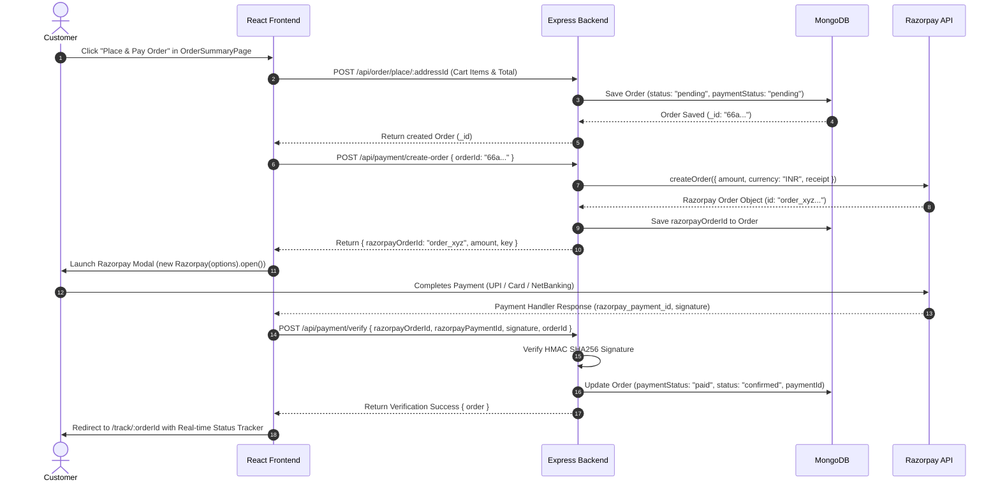

# Frontend & Backend Integration Architecture Document (`frontend.md`)

This document outlines the complete structural breakdown of the **Lizza Pizza App** frontend, routing setup, context state management, and detailed backend API contracts required for complete end-to-end integration.

---

## 1. Tech Stack Overview

* **Frontend:** React 19, Vite, Tailwind CSS v4, Lucide React icons, React Router DOM v7.
* **Backend:** Node.js, Express.js, MongoDB (Mongoose), JWT Authentication, Razorpay SDK, Nodemailer.
* **Base API URL:** `http://localhost:5000/api` (or environment-based URL).

---

## 2. Implemented Frontend Architecture

The frontend is built with **10 main pages** and modular navigation components (`Navbar.jsx`, `AdminSidebar.jsx`, `ScreenPreviewSidebar.jsx`).

### 2.1 Frontend Pages Breakdown

1. **`LoginPage.jsx` (Login & Registration)**
   * **Features:** Tab switching between Login & Register, password visibility toggle, email verification prompt, forgot password flow.
   * **Backend Integrations Required:** `POST /api/auth/login`, `POST /api/auth/register`, `GET /api/auth/reset-password`.

2. **`DashboardPage.jsx` (Pizza Menu & Discovery)**
   * **Features:** Banner carousel, category filter tabs (Pizzas, Sides, Drinks, Desserts), search bar, pizza cards grid with customizer triggers, quick cart drawer.
   * **Backend Integrations Required:** `GET /api/inventory/fetch-menu`, `GET /api/inventory/category/:category`.

3. **`PizzaBuilderPage.jsx` (Interactive Custom Pizza Studio)**
   * **Features:** Step-by-step visual pizza builder (Crust selection, Size, Sauce, Cheese, Topping stack calculator), dynamic price computation, "Add Custom Pizza to Cart".
   * **Backend Integrations Required:** Reads topping/crust pricing from `GET /api/inventory/fetch-menu`.

4. **`OrderSummaryPage.jsx` (Cart & Checkout)**
   * **Features:** Cart item list, quantity adjusters, address selector, coupon/promo code input, order price summary (Subtotal, Taxes, Delivery Fee, Discount), "Proceed to Payment" trigger.
   * **Backend Integrations Required:** `GET /api/address/get-all-address/:userID`, `POST /api/order/place/:addressId`, `POST /api/payment/create-order`, `POST /api/payment/verify`.

5. **`OrderTrackingPage.jsx` (Live Order Tracker)**
   * **Features:** Visual progress bar (`pending` → `confirmed` → `preparing` → `out-for-delivery` → `delivered`), delivery address summary, delivery agent contact info, estimated time.
   * **Backend Integrations Required:** `GET /api/order/get-order/:id`.

6. **`OrderHistoryPage.jsx` (Past Orders & Receipts)**
   * **Features:** List of previous orders, status badges, payment status (`paid`, `pending`), re-order button, item breakdown modal.
   * **Backend Integrations Required:** `GET /api/order/allOrders`, `DELETE /api/order/cancel-order/:id`.

7. **`UserProfilePage.jsx` (User Profile & Address Book)**
   * **Features:** Account details, saved address management (Add/Edit/Delete/Mark Default), security settings.
   * **Backend Integrations Required:** `GET /api/address/get-all-address/:userID`, `POST /api/address/add-address/:userID`, `PUT /api/address/update-address/:id`, `PUT /api/address/mark-default-address/:id`.

8. **`SearchSortPage.jsx` (Advanced Search & Filters)**
   * **Features:** Keyword search, dietary filters (Veg, Non-Veg, Spicy), price range slider, sort options (Popularity, Price Low-to-High, Rating).
   * **Backend Integrations Required:** `GET /api/inventory/fetch-menu`.

9. **`AdminInventoryPage.jsx` (Admin Menu & Inventory HQ)**
   * **Features:** Add new pizza item form, edit item modal, delete item trigger, toggle stock availability switch.
   * **Backend Integrations Required:** `POST /api/inventory/admin/add-item`, `PUT /api/inventory/admin/update-item/:id`, `PATCH /api/inventory/:id/available`, `DELETE /api/inventory/delete-item/:id`.

10. **`AdminOrderManagementPage.jsx` (Kitchen Order Control HQ)**
    * **Features:** Real-time order cards, status transition buttons (`Confirm Order` → `Start Preparing` → `Send for Delivery` → `Delivered`), order filtering by status.
    * **Backend Integrations Required:** `GET /api/order/admin/all`, `PUT /api/order/admin/:id/status`.

---

## 3. Recommended Frontend State Management (React Contexts)

To connect the UI seamlessly with the backend, implement **3 Core React Contexts**:

### 3.1 `AuthContext.jsx`
* **State:** `user`, `token`, `isAuthenticated`, `isAdmin`, `loading`.
* **Actions:** 
  * `login(email, password)`
  * `register({ username, email, password })`
  * `logout()`
  * `checkAuth()` (verifies session cookie on load)

### 3.2 `CartContext.jsx`
* **State:** `cartItems` (array of items with size, toppings, quantity, unit price), `selectedAddressId`, `appliedCoupon`.
* **Actions:** 
  * `addToCart(item)`
  * `updateQuantity(itemId, quantity)`
  * `removeFromCart(itemId)`
  * `clearCart()`

### 3.3 `OrderContext.jsx`
* **State:** `currentOrder`, `orderHistory`, `isLoading`.
* **Actions:** 
  * `placeNewOrder(addressId)`
  * `fetchUserOrders()`
  * `fetchOrderById(orderId)`
  * `cancelOrder(orderId)`

---

## 4. Backend Endpoints & API Contract Mapping

### 🔑 4.1 Auth Endpoints (`/api/auth`)
| Method | Route | Auth Req | Payload | Response |
| :--- | :--- | :--- | :--- | :--- |
| `POST` | `/api/auth/register` | No | `{ username, email, password }` | `{ message, user }` |
| `GET` | `/api/auth/login` | No | `{ email, password }` | `{ message, user, token }` (Sets Cookie) |
| `GET` | `/api/auth/verify-email/:token` | No | `:token` param | `{ message, success }` |
| `GET` | `/api/auth/reset-password` | Yes | Token in headers/cookies | `{ message }` |

### 🍕 4.2 Inventory Endpoints (`/api/inventory`)
| Method | Route | Auth Req | Payload | Response |
| :--- | :--- | :--- | :--- | :--- |
| `GET` | `/api/inventory/fetch-menu` | Yes | None | `[ { _id, name, category, price, isAvailable, sizes, toppings } ]` |
| `GET` | `/api/inventory/fetch-item/:id` | Yes | `:id` param | `{ item }` |
| `GET` | `/api/inventory/category/:category` | Yes | `:category` param | `[ items ]` |
| `POST` | `/api/inventory/admin/add-item` | Admin | `{ name, category, price, sizes, toppings }` | `{ message, item }` |
| `PUT` | `/api/inventory/admin/update-item/:id` | Admin | `:id` + update fields | `{ message, item }` |
| `PATCH` | `/api/inventory/:id/available` | Admin | `{ isAvailable: boolean }` | `{ message, item }` |
| `DELETE` | `/api/inventory/delete-item/:id` | Admin | `:id` param | `{ message }` |

### 🏠 4.3 Delivery Address Endpoints (`/api/address`)
| Method | Route | Auth Req | Payload | Response |
| :--- | :--- | :--- | :--- | :--- |
| `POST` | `/api/address/add-address/:userID` | Yes | `{ fullAddress, city, pincode, phone, isDefault }` | `{ message, address }` |
| `GET` | `/api/address/get-all-address/:userID` | Yes | `:userID` param | `[ addresses ]` |
| `GET` | `/api/address/get-address/:id` | Yes | `:id` param | `{ address }` |
| `PUT` | `/api/address/update-address/:id` | Yes | `:id` + updated address fields | `{ message, address }` |
| `PUT` | `/api/address/mark-default-address/:id`| Yes | `:id` param | `{ message, address }` |

### 🛒 4.4 Order Endpoints (`/api/order`)
| Method | Route | Auth Req | Payload | Response |
| :--- | :--- | :--- | :--- | :--- |
| `POST` | `/api/order/place/:addressId` | Yes | `{ items: [...], totalAmount }` | `{ message, order }` |
| `GET` | `/api/order/allOrders` | Yes | None | `[ userOrders ]` |
| `GET` | `/api/order/get-order/:id` | Yes | `:id` param | `{ order }` |
| `DELETE` | `/api/order/cancel-order/:id` | Yes | `:id` param | `{ message, order }` |
| `GET` | `/api/order/admin/all` | Admin | None | `[ allCustomerOrders ]` |
| `PUT` | `/api/order/admin/:id/status` | Admin | `{ status: "preparing" | "out-for-delivery" | "delivered" }` | `{ message, order }` |

### 💳 4.5 Razorpay Payment Endpoints (`/api/payment`)
| Method | Route | Auth Req | Payload | Response |
| :--- | :--- | :--- | :--- | :--- |
| `POST` | `/api/payment/create-order` | Yes | `{ orderId: "<Mongo_Order_ID>" }` | `{ success: true, razorpayOrderId, amount, currency, key }` |
| `POST` | `/api/payment/verify` | Yes | `{ razorpayOrderId, razorpayPaymentId, signature, orderId }` | `{ success: true, message, order }` |

---

## 5. End-to-End Payment & Order Integration Flow



---

## 6. Recommended Next Steps for Implementation

1. **Install Axios & Set Up API Instance:**
   Create `src/services/api.js` configured with `baseURL: 'http://localhost:5000/api'` and `withCredentials: true`.
2. **Implement React Contexts:**
   Wrap `<App />` in `AuthProvider`, `CartProvider`, and `OrderProvider`.
3. **Convert `App.jsx` to `react-router-dom`:**
   Replace tab-based rendering with standard `<BrowserRouter>`, `<Routes>`, and `<Route>` paths.
4. **Connect Razorpay SDK Script in `index.html`:**
   Ensure `<script src="https://checkout.razorpay.com/v1/checkout.js"></script>` is loaded in `frontend/index.html`.

---

## 7. Recommended Directory Folder Structure for Integration

To keep code clean and maintainable, create the following structure inside `frontend/src/`:

```
frontend/src/
├── api/
│   └── axiosInstance.js       # Base Axios instance with baseURL & withCredentials
├── services/                  # API call modules grouped by feature
│   ├── authService.js         # login(), register(), logout(), checkAuth()
│   ├── menuService.js         # fetchMenu(), getCategoryItems(), getItemDetails()
│   ├── addressService.js      # getAddresses(), addAddress(), updateAddress(), setDefault()
│   ├── orderService.js        # placeOrder(), getUserOrders(), getOrderById(), cancelOrder()
│   └── paymentService.js      # createPaymentOrder(), verifyPayment()
├── context/                   # Global state management
│   ├── AuthContext.jsx        # User login status, token, user profile, isAdmin flag
│   ├── CartContext.jsx        # Shopping cart state, items, quantity calculations, total
│   └── OrderContext.jsx       # Active order tracking & historical orders
├── components/                # Modular UI components (Navbar, PizzaCard, Sidebars, etc.)
├── pages/                     # Main view pages (Dashboard, Builder, Summary, Admin, etc.)
├── App.jsx                    # Central Router definition using react-router-dom
└── main.jsx                   # Mounts App wrapped in Context Providers
```

---

## 8. Exact Mapping: Frontend Page $\rightarrow$ Backend API Endpoint

| Frontend Page / File | User Action / Event | Backend API Route | Method | Data Sent (Request) | Expected Response |
|---|---|---|---|---|---|
| **`LoginPage.jsx`** | Submits Login Form | `/api/auth/login` | `GET` | `{ email, password }` | `{ message, user, token }` |
| | Submits Registration | `/api/auth/register` | `POST` | `{ username, email, password }` | `{ message, user }` |
| | Clicks Email Verify | `/api/auth/verify-email/:token` | `GET` | Token in URL params | `{ message, success }` |
| **`DashboardPage.jsx`** | Page Mount (Loads Menu) | `/api/inventory/fetch-menu` | `GET` | None | `[ { _id, name, price, sizes, toppings, isAvailable } ]` |
| | Selects Category (e.g. DRINKS) | `/api/inventory/category/:category` | `GET` | Category name in URL | `[ categoryItems ]` |
| **`PizzaBuilderPage.jsx`** | Page Mount | `/api/inventory/fetch-menu` | `GET` | None | Populates available crusts & toppings |
| **`OrderSummaryPage.jsx`**| Loads Saved Addresses | `/api/address/get-all-address/:userID` | `GET` | User ID in URL params | `[ addresses ]` |
| | Adds New Address | `/api/address/add-address/:userID` | `POST` | `{ fullAddress, city, pincode, phone, isDefault }` | `{ message, address }` |
| | Clicks "Place Order" | `/api/order/place/:addressId` | `POST` | `{ items, totalAmount }` | `{ message, order: { _id, ... } }` |
| | Triggers Razorpay | `/api/payment/create-order` | `POST` | `{ orderId: order._id }` | `{ razorpayOrderId, key, amount, currency }` |
| | Razorpay Success | `/api/payment/verify` | `POST` | `{ razorpayOrderId, razorpayPaymentId, signature, orderId }` | `{ success: true, message, order }` |
| **`OrderTrackingPage.jsx`**| Page Mount / Polling | `/api/order/get-order/:id` | `GET` | Order ID in URL params | `{ order: { status, items, totalAmount, deliveryAddress } }` |
| **`OrderHistoryPage.jsx`** | Page Mount | `/api/order/allOrders` | `GET` | None | `[ userOrders ]` |
| | Clicks "Cancel Order" | `/api/order/cancel-order/:id` | `DELETE` | Order ID in URL params | `{ message, order }` |
| **`UserProfilePage.jsx`** | Loads Addresses | `/api/address/get-all-address/:userID` | `GET` | User ID in URL params | `[ addresses ]` |
| | Updates Address | `/api/address/update-address/:id` | `PUT` | Updated address fields | `{ message, address }` |
| | Marks Default | `/api/address/mark-default-address/:id`| `PUT` | Address ID in URL params | `{ message, address }` |
| **`AdminInventoryPage.jsx`**| Adds Item | `/api/inventory/admin/add-item` | `POST` | `{ name, category, price, sizes, toppings }` | `{ message, item }` |
| | Edits Item | `/api/inventory/admin/update-item/:id`| `PUT` | Item ID + updated data | `{ message, item }` |
| | Toggles Availability | `/api/inventory/:id/available` | `PATCH` | `{ isAvailable: boolean }` | `{ message, item }` |
| | Deletes Item | `/api/inventory/delete-item/:id` | `DELETE` | Item ID in URL params | `{ message }` |
| **`AdminOrderManagementPage.jsx`**| Page Mount (Kitchen View) | `/api/order/admin/all` | `GET` | None | `[ allCustomerOrders ]` |
| | Updates Status | `/api/order/admin/:id/status` | `PUT` | `{ status: "preparing" \| "out-for-delivery" \| "delivered" }` | `{ message, order }` |
