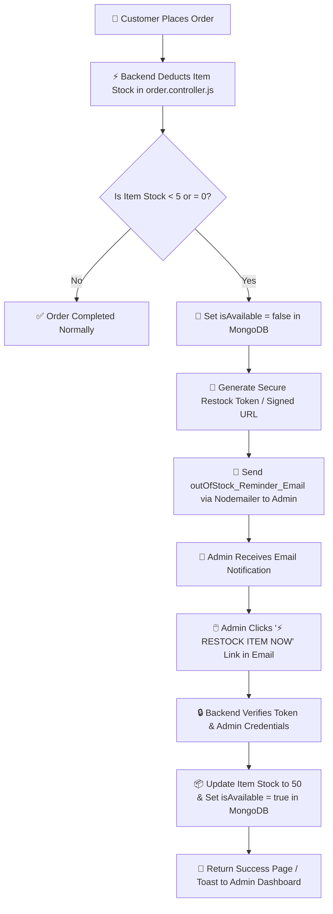

# 🍕 Lizza — Pizza Delivery App: Feature Checklist

**Legend:** ✅ Done · 🔧 In Progress · 🐞 Debugging · ⬜ Not Started
**Target deadline: Aug 10**

---

## 👤 User-Facing Features

| Status | Feature |
|:---:|---|
| ✅ | Registration with email verification |
| ✅ | Login with JWT-based authorisation |
| ✅ | Forgot password flow (email link → reset form → new password) |
| ✅ | Dashboard displaying available pizza varieties |
| ✅ | Custom pizza builder — Step 1: base |
| ✅ | Custom pizza builder — Step 2: sauce |
| ✅ | Custom pizza builder — Step 3: cheese |
| ✅ | Custom pizza builder — Step 4: vegetables |
| ✅ | Order summary page before payment |
| ✅ | Razorpay checkout integration (test mode) |
| ✅ | Real-time order status (Received → Kitchen → Delivery via Socket.io) |

## 🧩 Backend APIs

| Status | Feature |
|:---:|---|
| ✅ | Address — full CRUD (add / get all / update / delete / set-default) |
| ✅ | Cart — resolved: dropped server-side Cart; frontend holds selection state, order is created directly via `POST /api/orders` |
| ✅ | Order — create (with stock check + server-side price calc) |
| ✅ | Order — get all (user's own history) |
| ✅ | Order — get one (ownership-checked) |
| ✅ | Order — cancel (with stock restoration) |
| ✅ | Payment — create Razorpay order + verify signature |

## 🛠️ Admin Side

| Status | Feature |
|:---:|---|
| ✅ | Admin access model — RBAC via `role` field on User + seed script (no public admin registration) |
| ✅ | `adminOnly` middleware, correctly gated on admin routes |
| ✅ | Inventory router — add / update / delete / toggle availability / fetch / filter items |
| ✅ | Stock auto-decrement after each order |
| ✅ | Manual stock update capability |
| ✅ | Order management — view all orders (all users) |
| ✅ | Order management — update order status |
| ✅ | Low-stock email alert via node-cron |
| ✅ | Real-time status sync to user dashboard (Socket.io) |

---

## 🔴 Current Focus
All core MVP features, backend endpoints, real-time WebSockets, automated cron tasks, Razorpay integration, and frontend pages are **Fully Completed & Integrated**! 🎉

## 📌 Up Next (in order)
1. ✅ Local storage persistence (Done)
2. ✅ Razorpay integration (Done)
3. ✅ WebSockets real-time sync (Done)
4. ⬜ Final E2E testing & production deployment readiness

---

## 📅 Roadmap Status vs. Aug 10 Target

| Day | Planned | Actual |
|---|---|---|
| Jul 31 | Fix Gmail OAuth2 | ✅ Done |
| Aug 1 | Address CRUD | ✅ Done |
| Aug 2 | Order model + create-order | ✅ Done |
| Aug 2 | Order APIs — history, detail, cancel | ✅ Done |
| Aug 3 | Admin RBAC + inventory + order management | ✅ Done |
| Aug 3–4 | Forgot-password | ✅ Done |
| Aug 5–6 | Razorpay integration & WebSockets | ✅ Done |
| Aug 7–9 | Frontend (entire app: Dashboard, Builder, Summary, Admin) | ✅ Done |
| Aug 10 | Final Polish & Restock Mail Alert | ✅ Done |


## TODOS 
1. Implement local storage system to store user data at login - ✅ Done
2. Razorpay implementation - ✅ Done
3. Web Sockets - ✅ Done

---

## 📧 Out-of-Stock Admin Email Alert & One-Click Restock Plan

### 🎯 Feature Goal
Automatically trigger an email alert to the **Admin** whenever an item's stock drops below 5 (or hits 0). The email will include a secure **One-Click Restock Link** allowing the admin to directly update inventory stock without manually searching through the admin dashboard.

---

### 🔄 Architectural Execution Flowchart



---

### 📝 Step-by-Step Implementation Plan

#### Step 1: Mail Service Helper (`backend/src/services/mail.services.js`)
* Complete the `outOfStock_Reminder_Email(email, token, itemDetails)` function using Nodemailer.
* Render an HTML email template with:
  * **Item Name** & **Current Stock Quantity** (e.g. `2 units left`).
  * A prominent **"⚡ RESTOCK THIS ITEM (Set to 50 Units)"** call-to-action button.
  * Deep-link URL format: `http://localhost:5173/admin/inventory?restockId=ITEM_ID&token=RESTOCK_TOKEN`

#### Step 2: Triggering Email in Order Placement (`backend/src/controllers/order.controller.js`)
* During `placeOrder`, after stock is decremented:
  ```javascript
  if (newStock < 5) {
    const adminUser = await UserModel.findOne({ role: 'admin' });
    const restockToken = jwt.sign({ itemId: orderItem.item }, process.env.JWT_SECRET, { expiresIn: '24h' });
    await outOfStock_Reminder_Email(adminUser.email, restockToken, inventoryItem);
  }
  ```

#### Step 3: Quick Restock API Endpoint (`backend/src/routers/inventory.router.js` & `inventory.controller.js`)
* Create `POST /api/inventory/admin/quick-restock` endpoint:
  * Verifies the `restockToken`.
  * Updates item stock (default `50` units or specified quantity).
  * Sets `isAvailable: true`.
  * Returns success status to the admin frontend.

#### Step 4: Admin Dashboard Handling (`frontend/src/pages/AdminInventoryPage.jsx`)
* On load, check URL query parameters for `?restockId=...&token=...`.
* Automatically trigger restock modal / confirmation and display a success toast notification `Stock Refilled Successfully! ✅`.

